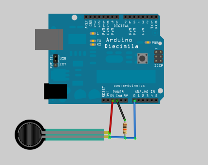
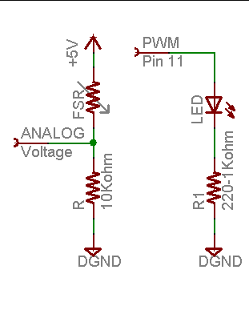
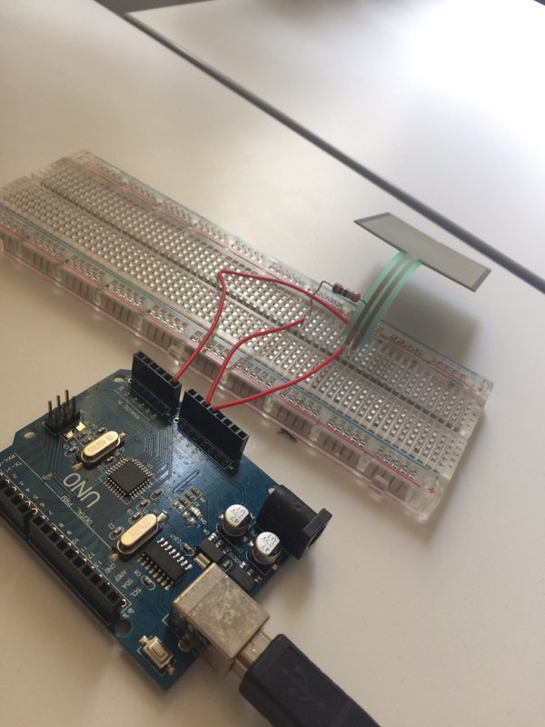

<h1 style="text-align:center;">2 Trash 1 Battle</h1>

<h2>Hover.css from https://github.com/IanLunn/Hover</h2>

npm install hover.css --save

bower install hover --save

<h2>Serial port serie python : pyserial</h2>

py -m pip install pyserial 

https://pythonhosted.org/pyserial/

<h1 style="text-align:center;">How it works with the Arduino ?</h1>

The easiest way to measure a resistive sensor is to connect one end to Power and the other to a pull-down resistor to ground. Then the point between the fixed pulldown resistor and the variable FSR resistor is connected to the analog input of a microcontroller such as an Arduino

For this example I'm showing it with a 5V supply but note that you can use this with a 3.3v supply just as easily. In this configuration the analog voltage reading ranges from 0V (ground) to about 5V (or about the same as the power supply voltage).

Concrete project here : 

